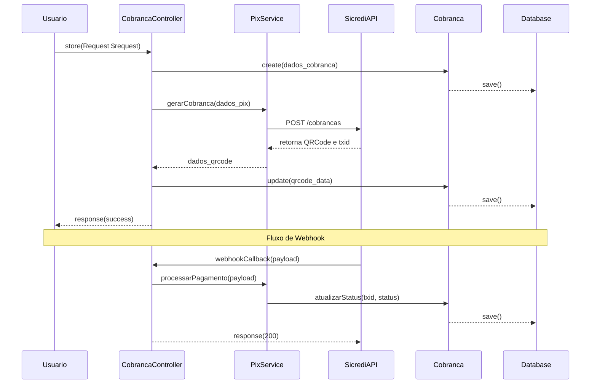
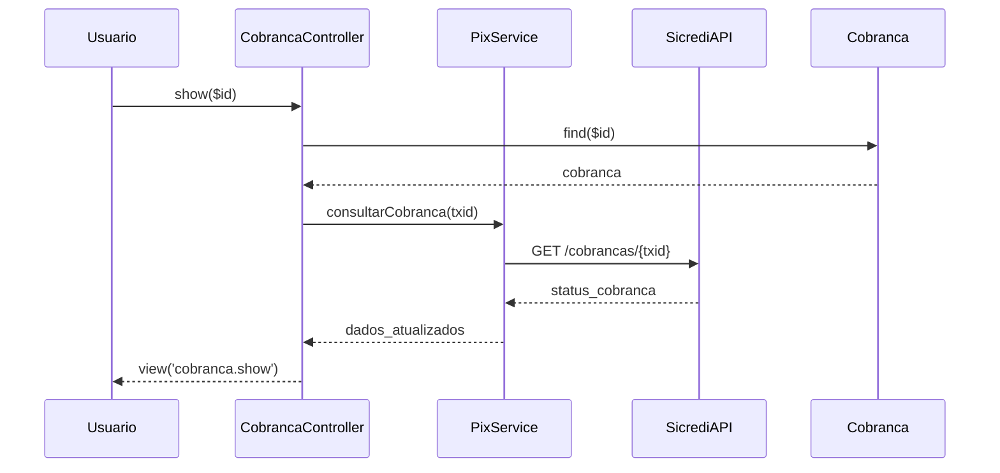

# Diagrama de Sequência - Cobrança PIX

## Fluxo de Geração de Cobrança

```mermaid
sequenceDiagram
    participant Usuario
    participant CobrancaController
    participant PixService
    participant SicrediAPI
    participant Cobranca
    participant Database

    Usuario->>CobrancaController: store(Request $request)
    CobrancaController->>Cobranca: create(dados_cobranca)
    Cobranca-->>Database: save()
    
    CobrancaController->>PixService: gerarCobranca(dados_pix)
    PixService->>SicrediAPI: POST /cobrancas
    SicrediAPI-->>PixService: retorna QRCode e txid
    PixService-->>CobrancaController: dados_qrcode
    
    CobrancaController->>Cobranca: update(qrcode_data)
    Cobranca-->>Database: save()
    CobrancaController-->>Usuario: response(success)

    Note over Usuario,Database: Fluxo de Webhook
    
    SicrediAPI->>CobrancaController: webhookCallback(payload)
    CobrancaController->>PixService: processarPagamento(payload)
    PixService->>Cobranca: atualizarStatus(txid, status)
    Cobranca-->>Database: save()
    CobrancaController-->>SicrediAPI: response(200)
```

## Fluxo de Consulta de Cobrança

```mermaid
sequenceDiagram
    participant Usuario
    participant CobrancaController
    participant PixService
    participant SicrediAPI
    participant Cobranca

    Usuario->>CobrancaController: show($id)
    CobrancaController->>Cobranca: find($id)
    Cobranca-->>CobrancaController: cobranca
    
    CobrancaController->>PixService: consultarCobranca(txid)
    PixService->>SicrediAPI: GET /cobrancas/{txid}
    SicrediAPI-->>PixService: status_cobranca
    PixService-->>CobrancaController: dados_atualizados
    CobrancaController-->>Usuario: view('cobranca.show')
```