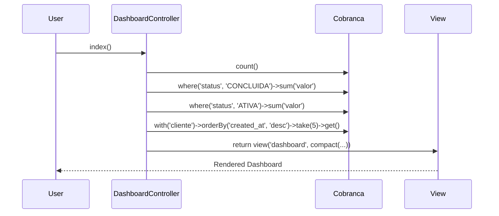
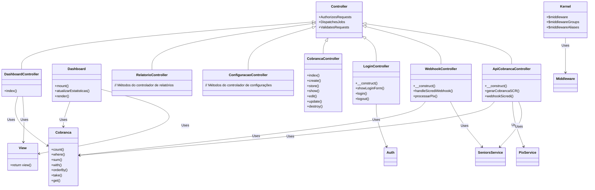

# Diagramas

## Diagrama de Sequência de Mensagens

```mermaid
sequenceDiagram
    participant User
    participant DashboardController
    participant Cobranca
    participant View

    User->>DashboardController: index()
    DashboardController->>Cobranca: count()
    DashboardController->>Cobranca: where('status', 'CONCLUIDA')->sum('valor')
    DashboardController->>Cobranca: where('status', 'ATIVA')->sum('valor')
    DashboardController->>Cobranca: with('cliente')->orderBy('created_at', 'desc')->take(5)->get()
    DashboardController->>View: return view('dashboard', compact(...))
    View-->>User: Rendered Dashboard
```

## Diagrama de Classes

```mermaid
classDiagram
    class DashboardController {
        +index()
    }
    class Cobranca {
        +count()
        +where()
        +sum()
        +with()
        +orderBy()
        +take()
        +get()
    }
    class View {
        +return view()
    }
    class Dashboard {
        +mount()
        +atualizarEstatisticas()
        +render()
    }
    class Kernel {
        +$middleware
        +$middlewareGroups
        +$middlewareAliases
    }
    class RelatorioController {
        // Métodos do controlador de relatórios
    }
    class ConfiguracaoController {
        // Métodos do controlador de configurações
    }
    class CobrancaController {
        +index()
        +create()
        +store()
        +show()
        +edit()
        +update()
        +destroy()
    }
    class LoginController {
        +__construct()
        +showLoginForm()
        +login()
        +logout()
    }
    class WebhookController {
        +__construct()
        +handleSicrediWebhook()
        +processarPix()
    }
    class ApiCobrancaController {
        +__construct()
        +gerarCobrancaSCR()
        +webhookSicredi()
    }
    class Controller {
        +AuthorizesRequests
        +DispatchesJobs
        +ValidatesRequests
    }

    DashboardController --> Cobranca : Uses
    DashboardController --> View : Uses
    Dashboard --> Cobranca : Uses
    Dashboard --> View : Uses
    WebhookController --> Cobranca : Uses
    ApiCobrancaController --> Cobranca : Uses
    ApiCobrancaController --> PixService : Uses
    ApiCobrancaController --> SeniorsService : Uses
    WebhookController --> SeniorsService : Uses
    LoginController --> Auth : Uses
    Kernel --> Middleware : Uses
    Controller <|-- DashboardController
    Controller <|-- RelatorioController
    Controller <|-- ConfiguracaoController
    Controller <|-- CobrancaController
    Controller <|-- LoginController
    Controller <|-- WebhookController
    Controller <|-- ApiCobrancaController
```
